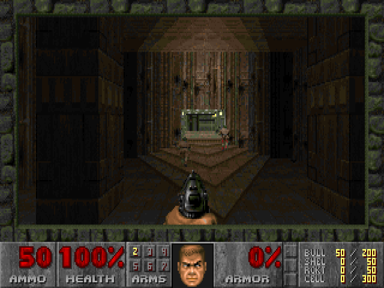
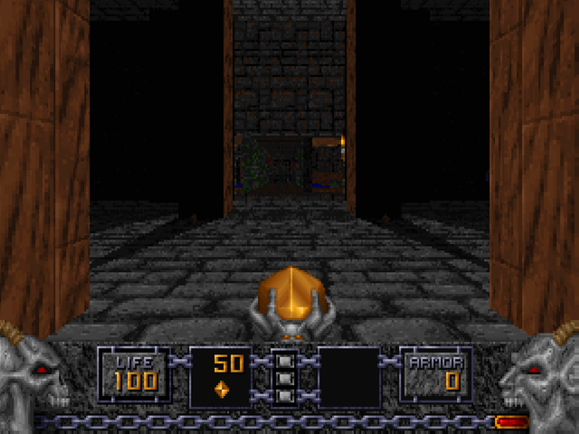
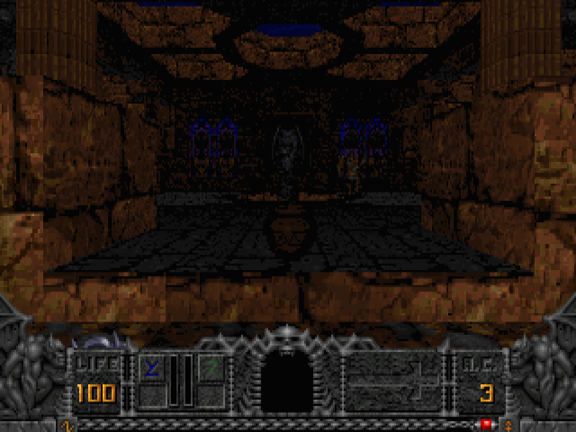
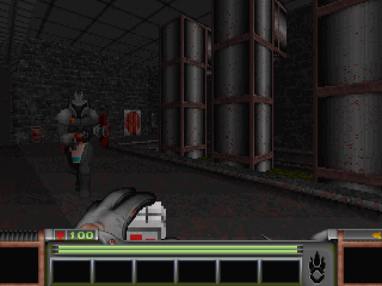
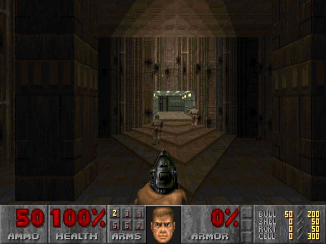
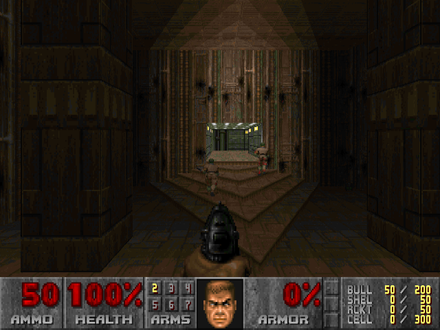
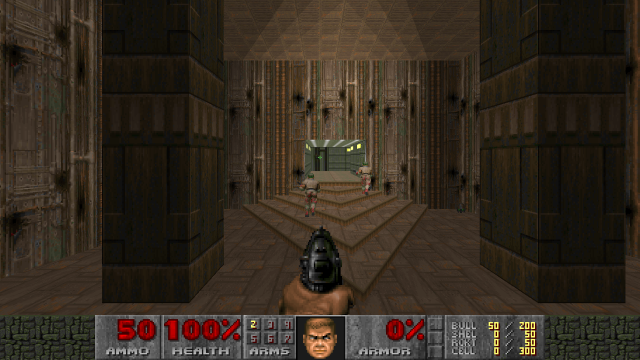
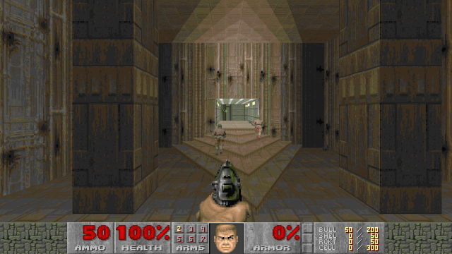

PortaDOOM Launcher
================================================================================

_PortaDOOM Launcher_ manages the complexities of playing custom DOOM maps and
mods. The history of DOOM engines is [complicated and branching][1], and _PortaDOOM Launcher_ presents a single interface to selecting the desired combination of IWAD (e.g. "DOOM2.WAD"), engine (e.g. GZDoom) and any particular DOOM mods -- known as "WAD"s, which can be new maps or gameplay enhancements.

[1]: https://commons.wikimedia.org/wiki/File:Doom-Ports.png

Command-Line Usage:

	launcher.exe [/USE <engine>] [/WAIT] [/SW] [/32] [/DEFAULT]
		[/IWAD <file>] [/PWAD <file>] [/DEH <file>] [/BEX <file>]
		[/DEMO <file>] [/WARP <number>] [/SKILL <number>]
		[/CMPLVL <number>] [/EXEC <file>]
		[-- <files>...]

Example:

	launcher.exe /USE gzdoom /IWAD DOOM2 /PWAD crumpets.wad

--------------------------------------------------------------------------------

In most instances, a game is inseparable from its executable and you never have to think about it. DOOM is very different. Since the release of the source code in 1997, there have been innumerable replacement engines (often known as "source-ports") to play the same game. So broad and multifarious are the ports of DOOM that it is considered to be the "Hello World" of gaming, having appeared on [digital cameras][d], [printers][p], [ATMs][a] and even [keyboards][k]. If it has a screen, it (probably) runs DOOM.

[d]: https://www.youtube.com/watch?v=k-AnvqiKzjY
[p]: https://www.youtube.com/watch?v=XLHx3vO7KJM
[a]: https://www.youtube.com/watch?v=PW5ELKTivbE
[k]: https://www.youtube.com/watch?v=GD0L46y3IqI

Over time DOOM source-ports have extended the game with new features and capabilities. Playing DOOM mods in the present day involves selecting the correct engine to match the requirements of the desired WAD.

`/USE <engine>`
--------------------------------------------------------------------------------

<!--Engines are stored in the "files\ports" folder. Note that most PortaDOOM packages do **not** include the full suite of engines; only those relevant to the particular package.

Each folder within the "ports" folder will contain a "porta-doom.ini" file that provides the meta-data for each engine.-->

Which engine (a.k.a. "source-port") to use. \
Can be any of the following:

### `choco-doom`

[Chocolate Doom](https://www.chocolate-doom.org) is an exact recreation of the original MS-DOS DOOM for modern systems, including original limitations and bugs! Its purpose is to preserve the exact behaviour of the original DOOM executable in an accessible manner so that authors can ensure compatibility without having to use DOS Box or an actual 486 PC.

Chocolate Doom does provide a number of modern conveniences, but as a pure "vanilla" source-port it does no graphical enhancements and the game is always rendered in the original 320×200 resolution.

Chocolate Doom is preferred by purists and map authors wishing to ensure absolute compatibility.

Chocolate Doom can **only** run DOOM and DOOM-II type WADs, it cannot run Heretic, Hexen or Strife type WADs, see Chocolate Heretic etc. below.

Use `choco-doom-setup` to run the setup utility prior to launching the game.

### `choco-heretic`

[Chocolate Heretic](https://www.chocolate-doom.org/wiki/index.php/Chocolate_Heretic) is, like Chocolate Doom, an exact replica of the original Heretic MS-DOS executable for modern systems.

Chocolate Heretic can **only** run Heretic-type WADs.

Use `choco-heretic-setup` to run the setup utility prior to launching the game.

### `choco-hexen`

[Chocolate Hexen](https://www.chocolate-doom.org/wiki/index.php/Chocolate_Hexen) is, like Chocolate Doom, an exact replica of the original Hexen MS-DOS executable for modern systems.

Chocolate Hexen can **only** run Hexen-type WADs.

Use `choco-hexen-setup` to run the setup utility prior to launching the game.

### `choco-strife`

[Chocolate Strife](https://www.chocolate-doom.org/wiki/index.php/Chocolate_Strife) is, like Chocolate Doom, an exact replica of the original Strife MS-DOS executable for modern systems.

Chocolate Strife can **only** run Strife-type WADs.

Use `choco-strife-setup` to run the setup utility prior to launching the game.

### `crispy-doom`

[Crispy Doom](https://www.chocolate-doom.org/wiki/index.php/Crispy_Doom) is a modification of Chocolate Doom to remove limits, increase resolution (to 640×400) and add new features, all while remaining faithful to original DOOM.

Crispy Doom would appeal to players wanting to keep the original aesthetic of DOOM whilst gaining access to the broader range of "limit-removing" WADs without dealing with the crashes and hard limits of Chocolate DOOM.

Crispy Doom can **only** run DOOM and DOOM-II type WADs.

Use `crispy-doom-setup` to run the setup utility prior to launching the game.

### `doom-retro`

[DOOM Retro](http://doomretro.com/) is a limit-removing port of Chocolate Doom that focuses on a 'nostalgic' feel, rather than hard accuracy.

DOOM Retro would appeal to most players as their go-to "vanilla" engine.

### `prboom-plus`

One of the first source-ports to extend the original game was _Boom_. It added new capabilities to the DOOM map format and removed existing limits. These extensions were adopted by other engines and thus "boom" became a new base-line standard available to mappers. To this day, _boom_-format maps are still being made.

[PrBoom+](http://prboom-plus.sourceforge.net/) was an offshoot of the original _Boom_ when it was discontinued. It is a speed and compatibility focused Boom engine.

As well as being able to play boom-format maps that Chocolate/Crispy-Doom cannot, PrBoom+ is also incredibly fast, spitting out high frame-rates on even basic hardware.

PrBoom+ is recommended for users with laptops, integrated graphics and systems with outdated graphics cards.

Use `prboom-plus-sw` (or the `/SW` switch) to use the software renderer. This is restricted to 256 colours and may be faster for systems with extremely limited OpenGL acceleration, but an otherwise adequate processor.

### `gzdoom`

For GZDoom, specific versions can be invoked with the following:

| Engine-ID   | Version        | Date
|-------------|----------------|--------------------------------------
| `gzdoom-10` | GZDoom v1.0.32 | FEB-2006
| `gzdoom-11` | GZDoom v1.1.06 | FEB-2008
| `gzdoom-12` | GZDoom v1.2.01 | MAR-2009
| `gzdoom-13` | GZDoom v1.3.17 | OCT-2009
| `gzdoom-14` | GZDoom v1.4.08 | JAN-2010
| `gzdoom-15` | GZDoom v1.5.06 | AUG-2010
| `gzdoom-16` | GZDoom v1.6.00 | JUL-2012
| `gzdoom-17` | GZDoom v1.7.01 | DEC-2012
| `gzdoom-18` | GZDoom v1.8.10 | JUN-2013
| `gzdoom-19` | GZDoom v1.9.1  | FEB-2016
| `gzdoom-20` | GZDoom v2.0.05 | SEP-2014
| `gzdoom-21` | GZDoom v2.1.1  | FEB-2016
| `gzdoom-22` | GZDoom v2.2.0  | SEP-2016
| `gzdoom-23` | GZDoom v2.3.0  | JAN-2017
| `gzdoom-24` | GZDoom v2.4.0  | MAR-2017
| `gzdoom-32` | GZDoom v3.2.4  | OCT-2017 (1)
| `gzdoom-33` | GZDoom v3.3.0  | MAR-2018
| `gzdoom-34` | GZDoom v3.4.1  | JUN-2018
| `gzdoom-35` | GZDoom v3.5.1  | JUL-2018

1. versions 3.0 (APR-2017), 3.1 (JUN-2017) and 3.2.0 (OCT-2017) are excluded due to a security concern

### `zandronum`

Zandronum is a multi-player focused fork of GZDoom.

### `doom64ex`

### `zdoom`

`/WAIT`
--------------------------------------------------------------------------------
Causes "launcher.exe" to not immediately return once the engine is launched.
Script execution will continue only once the engine has quit.

`/SW`
--------------------------------------------------------------------------------
Force software rendering. By default hardware rendering is used in GZDoom and PRBoom+ ("glboom-plus").

`/32`
--------------------------------------------------------------------------------
Always use 32-bit binaries, even on a 64-bit system.

`/DEFAULT`
--------------------------------------------------------------------------------
Loads the engine with the default config file instead of the current user config file. Any changes you make to the engine's settings will be saved in the default configuration file.

`/IWAD <file>`
--------------------------------------------------------------------------------
The IWAD (Internal WAD) is the base WAD to use. This will be one of the original game's WAD files which maps, mods and total conversions extend.

IWADs are located in the "wads" folder.

If this option is omitted the default IWAD will be based on the selected engine. Some engines support only a certain game, i.e.

| Engine ID           | Default WAD  |
|---------------------|--------------|
| `chocolate-heretic` | HERETIC.WAD  |
| `chocolate-hexen`   | HEXEN.WAD    |
| `chocolate-strife`  | STRIFE1.WAD  |
| `doom64ex`          | DOOM64.WAD   |

All other engines default to "DOOM2.WAD" as this is the most common one used for community content.

### Steam & GOG:

If the given IWAD cannot be found in the "wads" folder, the launcher will try to locate them automatically for you in any relevant Steam or GOG installations:

|    Platform | Game                  | Associated WAD                    |
|------------:|-----------------------|-----------------------------------|
|       Steam | The Ultimate DOOM     | DOOM.WAD                          |
|       Steam | DOOM II               | DOOM2.WAD                         |
|       Steam | Final DOOM            | TNT.WAD & PLUTONIA.WAD            |
|       Steam | DOOM Classic Complete | (all of the above)                |
| GOG / Steam | DOOM 3 BFG Edition    | DOOM.WAD & DOOM2.WAD              |
|         GOG | The Ultimate DOOM     | DOOM.WAD                          |
|         GOG | DOOM II + Final DOOM  | DOOM2.WAD, TNT.WAD & PLUTONIA.WAD |
|       Steam | Heretic               | HERETIC.WAD                       |
|       Steam | Hexen                 | HEXEN.WAD                         |
| GOG / Steam | The Original Strife   | STRIFE1.WAD                       |

### Shareware:

If the given IWAD cannot be found and no PWAD is specified (see below), i.e. you are trying to play an original game rather than a custom-map / mod, then the equivalent shareware will be used instead:

|    Game | Registered WAD | Shareware WAD | Notes             |
|--------:|----------------|---------------|-------------------|
|    DOOM | DOOM.WAD       | DOOM1.WAD     | Episode 1 only    |
| Heretic | HERETIC.WAD    | HERETIC1.WAD  | Episode 1 only    |
|   Hexen | HEXEN.WAD      | HEXEN.WAD     | Shareware version |
|  Strife | STRIFE1.WAD    | STRIFE0.WAD   | Shareware version |

NOTE: There was no shareware release for DOOM II.

## `/PWAD <file>`

The PWAD ("Patch-WAD") is the community map / mod you want to play.  
These are assumed to be in the "wads" folder. E.g.

	launcher.exe /USE gzdoom /IWAD DOOM2 /PWAD wolfendoom.pk3

If you just want to play an original game (e.g. DOOM, Hexen) then the PWAD is not required.

### Steam & GOG:

If "NERVE.WAD" or any of the "Master Levels for DOOM II" are specified as the PWAD and cannot be found in the "wads" folder, the launcher will try to locate them for you in any relevant Steam or GOG installations:

|    Platform | Game                  | Associated PWAD                   |
|------------:|-----------------------|-----------------------------------|
| GOG / Steam | DOOM 3 BFG Edition    | NERVE.WAD                         |
|       Steam | DOOM Classic Complete | Master Levels for DOOM II         |
|         GOG | DOOM II + Final DOOM  | Master Levels for DOOM II         |

### FreeDOOM:

When using a PWAD, if an IWAD of "DOOM" or "DOOM2" is specified, but these WAD files are not present, FreeDOOM will be used instead, though a warning will be presented.

Whilst DOOM gameplay mods and maps work off of DOOM.WAD or DOOM2.WAD, FreeDOOM is intended as a drop-in replacement, maintaining compatibility with DOOM.WAD & DOOM2.WAD allowing you to play most community content without having to actually purchase DOOM.

`/DEH <file>` & `/BEX <file>`
--------------------------------------------------------------------------------
Early DOOM modifications were done by way of a live patching system known as "DeHackEd". These ".deh" files are common, even today, as the lowest-common-denominator of DOOM modding.

Boom, a highly-influential early source-port, enhanced this format further with "Boom-EXtended" DeHackEd files.

These parameters specify a DEH or BEX file to load alongside any WADs.

`/DEMO <file>`
--------------------------------------------------------------------------------
DOOM play sessions can be recorded and played back later. These are often distributed as lump (".lmp") files. The `/DEMO` parameter specifies the file to play.

Unlike the `-playdemo` engine parameter that requires the path to be valid, PortaDOOM Launcher will look for the demo file in the 'current' directory from which the launcher has been called, the "wads" directory, and if a PWAD is given, in its directory too.

`/WARP <number>`
--------------------------------------------------------------------------------
Warp to the given map number. For games with episodes, such as DOOM and Heretic, this is in the format "e.m" where "e" is the Episode number and "m" is the Map number, e.g. `/WARP 2.4`. For games without episodes like DOOM II, it's just a single number e.g. `/WARP 21`.

`/SKILL <number>`
--------------------------------------------------------------------------------
Set skill (difficulty) level. This is a number nominally 1 to 5, but this may vary with mods. A value of 0 disables monsters on some engines, but this can sometimes prevent a level from being completable.

`/CMPLVL <number>`
--------------------------------------------------------------------------------
Specifies the compatibility level, a feature provided by PrBoom+ to emulate the behaviour of different versions of the original DOOM executable. The number can be:

        0     = Doom v1.2
        1     = Doom v1.666
        2     = Doom v1.9
        3     = Ultimate Doom & Doom95
        4     = Final Doom
        5     = DOSDoom
        6     = TASDOOM
        7     = Boom's inaccurate vanilla compatibility mode
        8     = Boom v2.01
        9     = Boom v2.02
        10    = LxDoom
        11    = MBF
        12-16 = PrBoom (old versions)
        17    = Current PrBoom

`/EXEC <file>`
--------------------------------------------------------------------------------
Execute the script file.

`-- <files>...`
--------------------------------------------------------------------------------
NOTE: The `--` is required to separate the parameters from the list of files.

A list of additional files to include (from the "wads" directory). Unlike when creating Windows shortcuts, the "wads" folder is assumed, so that you don't need to include the base path on each file added.

If a PWAD has been given, that file's folder will also be checked so that you do not have to give the path for both the PWAD, and any files within the same folder. E.g.

	launcher.exe /PWAD doomrl_arsenal\doomrl_arsenal.wad -- doomrl_arsenal_hud.wad

After one file is included, the same folder will be checked for the next file. This is handy for including multiple WADs located in the same folder, e.g.

	launcher.exe -- BrutalDoom\Brutalv20b.pk3 ExtraTextures.wad

Where "ExtraTextures.wad" is in the "BrutalDoom" folder, and if it isn't the base "wads" folder will be checked and then the engine's folder.

Config Files
--------------------------------------------------------------------------------

For portability PortaDOOM Launcher has default configuration files for each engine which will be copied to the save folder for that engine when one does not exist. The engine is automatically launched with this portable config file so that your settings are used regardless of which machine you use.

Save-Games
--------------------------------------------------------------------------------
Save-games are not saved alongside the engine as is default, but rather in a "saves" folder. To prevent incompatibilities and potential data-loss between engines, save-games are first separated by engine ("gzdoom" / "zandronum" etc.) and then by the PWAD name (or IWAD name if no PWAD is specified). I.e. for the command:

	launcher.exe /USE gzdoom /IWAD DOOM2 /PWAD breach.wad

The savegames will be located in "saves\gzdoom\breach\".