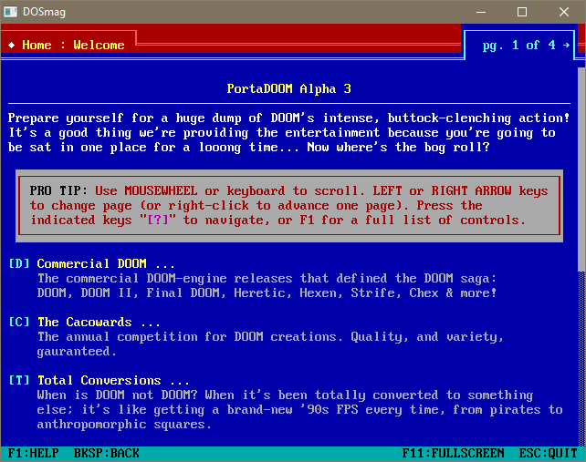

# PortaDOOM #

A self-contained, portable [DOOM](https://en.wikipedia.org/wiki/Doom_(1993_video_game)) launcher and [WAD](https://en.wikipedia.org/wiki/Doom_WAD) collection presented as an early '90s MS-DOS [diskzine](https://en.wikipedia.org/wiki/Disk_magazine).

It's intended as a single download that people can unzip and play on any computer, targeted at people who have either never played DOOM or anything beyond the official iD canon and the thought of downloading, configuring and launching several different engines with all kinds of weird WAD files is putting them off trying stuff out.

PortaDOOM is about having a single executable where you press a few keys and hey-presto! you're playing DOOM WADs in the correct engine with the correct settings.

The viewer is written in [QB64](http://www.qb64.net/); a modern remake of Microsoft's classic [QuickBASIC](https://en.wikipedia.org/wiki/QuickBASIC) for that DOS look and feel, but you do not need to be able to code to contribute: all the diskzine pages are just text-files that anybody can create and edit.

You can contribute the following ways:
*   Write pages yourself using [this handy guide](DOSmag/README.md#how-to-write-pages)
*   File GitHub Issues for suggestions and fixes
*   E-mail me: <kroc@camendesign.com>

Have fun and DOOM on!